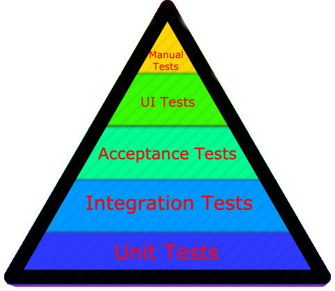

# Software Testing
A process in-which software is verified for correctness, quality, and performance. Software testing is used to ensure that expected business systems and product features work as expected as well as helping to enhance the quality applications while reducing costs, maximizing ROI, and saving development time.

### Unit Tests 
Unit tests ensure that every unit of code functions correctly independently. The thought is that if every unit works as expected, it should be easy to combine the units and build an application.

Unit tests are normally small tests that exercise a single method. 
With unit tests the idea is to test each piece of logic with numerous context scenarios. They are fast, and when managed properly (using mocks rather than DB or external calls), offer instant feedback. 

Unit tests are expected to be simple to write. Some will suggest that when a unit test is difficult to write it may be a sign that the method being tested, needs to be broken down into smaller units.

Unit tests are normally written by the developer, either with test driven development (TDD), or to test after the code is written, and should be run before each code push.

### Integration Tests
Integration tests are used to simulate real-world workflows and test how various units of an application interact. 

With Integration tests the idea is that although the individual units function independently, these tests making sure all the units work together as a whole.

Integration tests are normally the second tier of testing (unit testing is first), are more complex than unit tests, and take longer to run.

Integration Tests are normally written by the developer, but can also be written as part to the Test Automation/ QA process.

### Acceptance Tests
Acceptance tests, like Integration tests are used to test combined units working as a whole, but they are written from a user’s perspective. These tests are usually written in a way that describes the behavior of the system rather than the function and simulate a user’s experience.

Acceptance Tests are normally written by Test Automation/ QA process.

### UI Tests
UI test are automated tests that drive the web browser. These tests are used perform mouse movements as well as keyboard and other input device action (Clicking a link, typing text, etc…).

UI Tests are normally written by Test Automation/ QA process.

### Manual Tests
The name says it all. With Manual test a user (or team of users) manually runs the software/product to ensure it behaves as expected.

This process often includes a check list of manual tasks to be tested